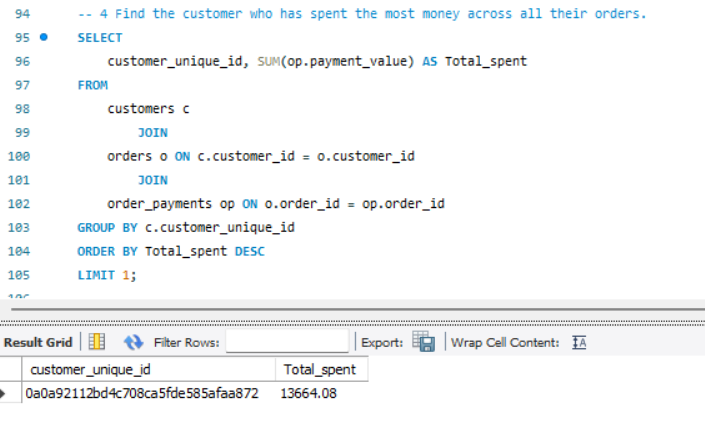
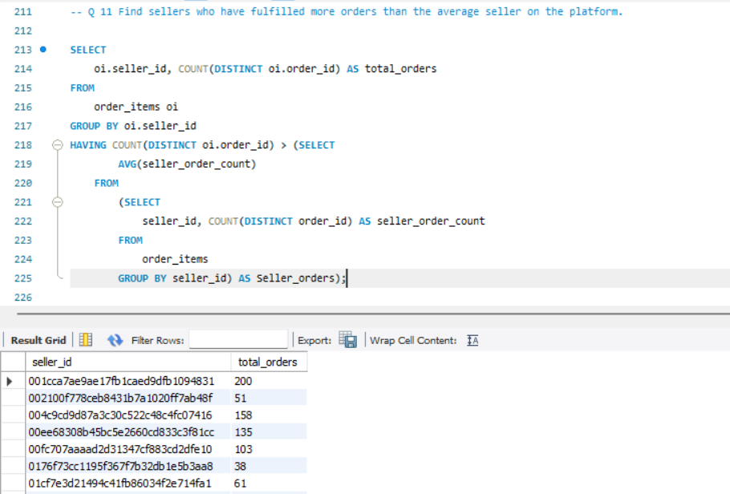
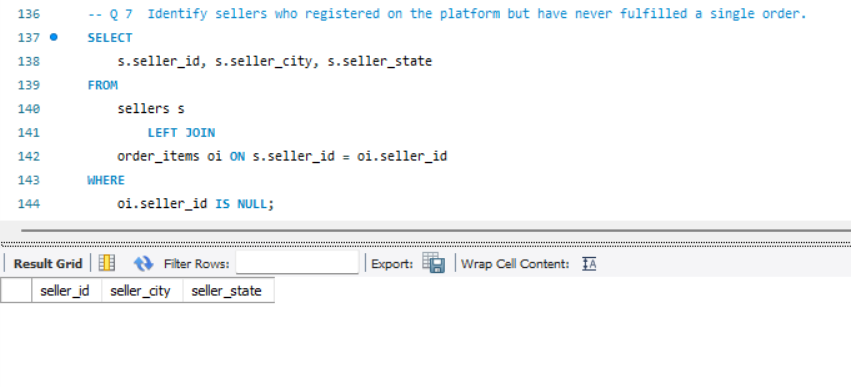
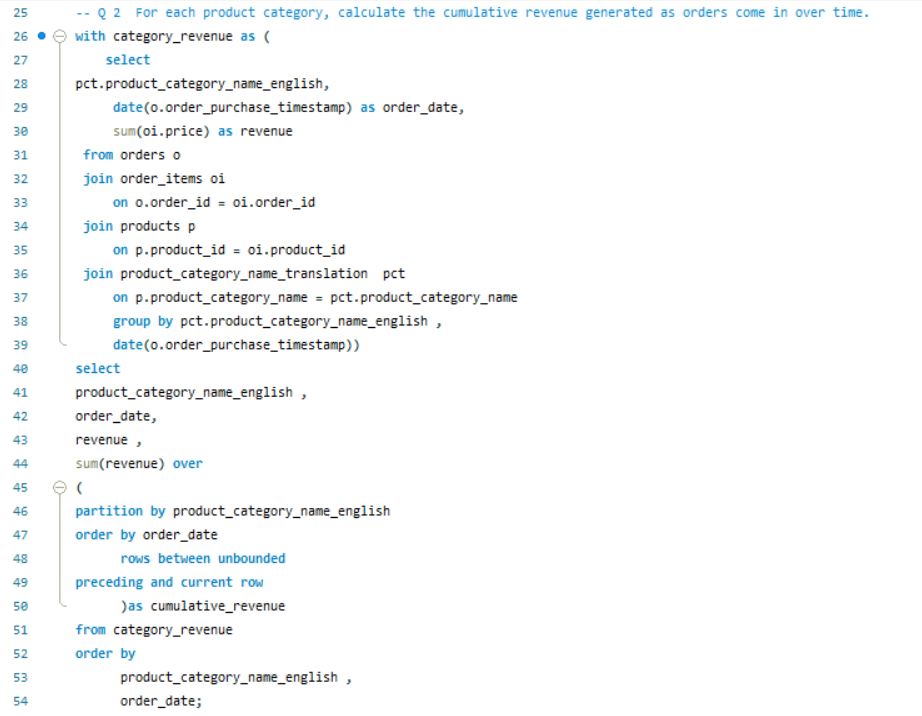
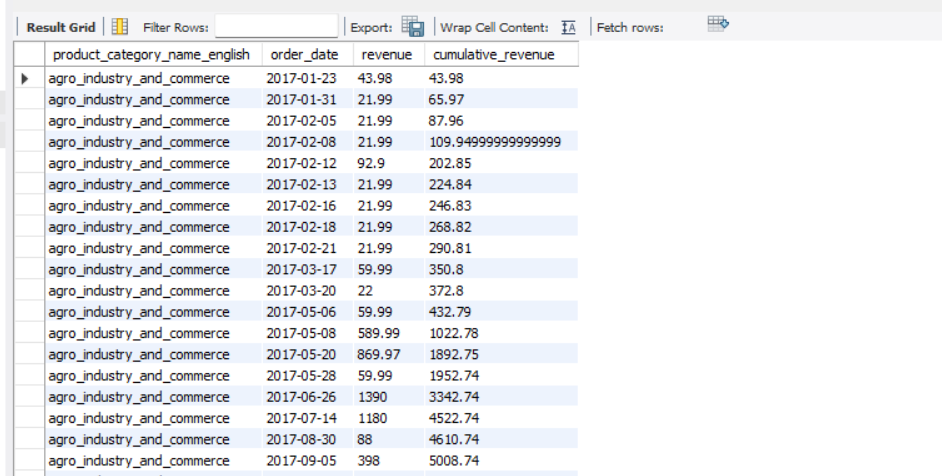
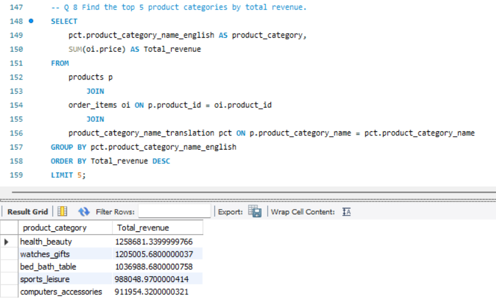
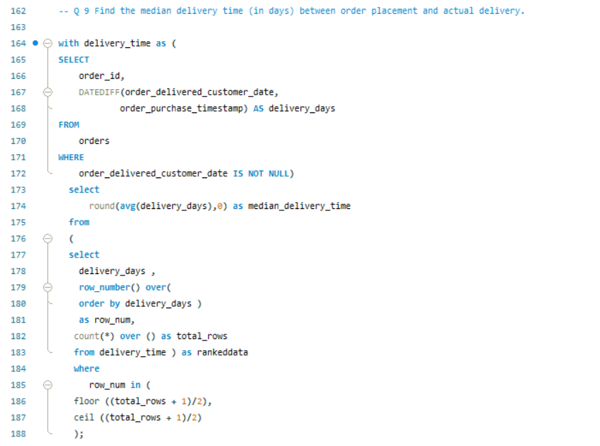
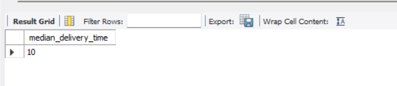

```markdown
# Amazon Brazil Marketplace Analytics 📊

## Project Overview
This project analyzes Amazon Brazil marketplace data to understand business performance across customers, sellers, products, revenue, and operations using SQL.

The objective of this analysis was to convert raw e-commerce transactional data into meaningful business insights by solving real-world marketplace problems related to customer behavior, seller performance, product trends, and operational efficiency.

---

## 📂 Repository Structure

* 📁 **SQL_Queries/**
  * 📄 **[Amazon_Brazil_Analysis.sql](Amazon_Brazil_Analysis.sql)** — *Main analytical SQL queries for business insights.*
* 📁 **Documentation/**
  * 📕 **[Amazon_Brazil_Marketplace_Analytics.pdf](Amazon_Brazil_Marketplace_Analytics.pdf)** — *Executive presentation & final report.*
* 📁 **Screenshots/**
  * 🖼️ **SQL analysis screenshots and query outputs**

---

## Business Areas Analyzed

### Customer & Market Intelligence
- Identified high-value customers based on their total spending.
- Analyzed customer ordering behavior across different states.
- Evaluated customer engagement through review participation.



### Seller Performance & Fulfillment
- Analyzed seller contribution across different states.
- Identified seller activity and marketplace participation.
- Evaluated seller performance compared with platform averages.





### Revenue & Product Portfolio Analytics
- Analyzed cumulative revenue growth across product categories.
- Studied category-level revenue contribution patterns.
- Evaluated product demand and catalog performance.







### Operations & Customer Experience
- Analyzed customer payment preferences.
- Evaluated delivery performance using median delivery time.





---

## SQL Advanced Techniques Used
- **Complex Joins** across multiple tables (Orders, Customers, Payments, Reviews).
- **Common Table Expressions (CTEs)** for modular and readable query logic.
- **Window Functions** (`ROW_NUMBER()`, `RANK()`, `SUM() OVER`) for deep-dive trends.
- **Advanced Aggregations** & Date-time functions for temporal analysis.

---

## Tools & Technologies
- **Database Server:** MySQL
- **Client Tool:** MySQL Workbench
- **Skills:** Data Analysis, Business Analytics, SQL Query Optimization

---

## Conclusion
This project demonstrates the use of SQL to analyze large-scale e-commerce data and transform it into a better understanding of marketplace performance and highlights opportunities for improving operational efficiency.

---

## Author
*Kavita Kanwar Naruka*

- **LinkedIn:** [kavita-kanwar1190](https://www.linkedin.com/in/kavita-kanwar1190)
- **Email:** [kavita.kanwar1190@gmail.com](mailto:kavita.kanwar1190@gmail.com)
```
